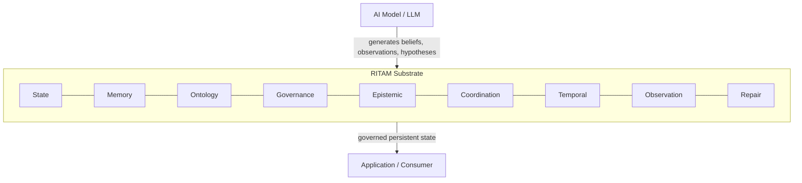

# RITAM Technical Overview
**Version:** v1.1.1  
**Status:** Phase 2 · Public Canon · D1  
**Authored:** Session 113 · 2026-06-23  
**Primary reader:** A competent systems engineer or ML researcher who has not heard of RITAM.  
**Purpose:** Accurate mental model formation. Not inspiration. Not hype.

---

## Evidence Notation

This document distinguishes three levels of claim throughout:

> **Demonstrated:** Observed in running code, verified by tests, and/or independently reproduced. Claims at this level are supported by specific experimental evidence.

> **Inferred:** Consistent with all observations and no current counterexample, but not yet independently validated. Stated as a working position, not a settled fact.

> **Open:** Not yet resolved. Named explicitly because hiding uncertainty is an architectural failure of a different kind.

---

## 1. What Problem Exists

An AI system that operates over time develops cognitive state: beliefs, memories, inferences, observations, contradictions. Unlike structured data in a database, this state is typically held with no governance — there is no principled mechanism for admission, no decay policy, no contradiction detection, and no observable repair path.

The result is a cluster of failure modes that are well-documented empirically. RITAM was founded on the hypothesis that no existing runtime layer addresses these failure modes as a unified governed substrate — that gap is the founding premise of RITAM, not a finding derived from RITAM's own research:

**Drift.** Beliefs change through incremental updates with no record of what changed, when, or why. The system "believes" something different from what it believed an hour ago, with no visible transition.

**Contradiction accumulation.** Two sources assert conflicting beliefs. Both enter the system. Neither is surfaced. The system operates on an internally inconsistent knowledge base with no signal that this is happening.

**Uncontrolled decay.** Old beliefs are never retracted; they simply become stale. A conclusion from two years ago has the same weight as an observation from this morning. There is no mechanism to distinguish recency of evidence from authority of evidence.

**Opacity.** When the system produces an incorrect output or an inconsistent belief, there is no audit trail. Governance decisions — what was admitted, what was rejected, what was repaired — are not observable. Diagnosis requires guesswork.

These are not failures of model capability. They are failures of the runtime layer beneath the model: the substrate that should hold cognitive state under principled governance but currently does not exist.

---

## 2. What Is RITAM

RITAM is a **governed cognition substrate** — a runnable layer that sits beneath an application and holds its cognitive state under explicit governance.

**RITAM is NOT:**
- An AI model, LLM, or fine-tuned variant
- An agent or autonomous reasoning system
- A safety layer or alignment technique
- An application, chatbot, or end-user product
- A research paper, theory, or framework that has not been implemented
- A wrapper, orchestration layer, or prompt engineering technique

The best analogy is infrastructure: as a database manages persistent structured data with principled admission, indexing, and recovery, RITAM manages persistent cognitive state with governed admission, epistemic tracking, and observable repair. A database does not generate data; it holds and manages it. RITAM does not generate beliefs; it holds and governs them.

RITAM sits between a model (which generates) and an application (which consumes). Its job is to ensure that what persists between those two layers is internally consistent, appropriately aged, and governed by explicit rules rather than accumulation by default.

*The nine primitives are not independent modules — each carries load in cross-primitive scenarios. Disabling any one causes observable failure in the adversarial test suite.*

---

## 3. Why Nine Primitives

The nine primitives are not a feature list. They were derived by asking a specific question for each candidate: **what failure appears in a running system if this primitive does not exist?**

| Primitive | Failure without it |
|---|---|
| **State** | The system cannot determine what it currently believes vs. what it has retracted. Active and superseded beliefs are indistinguishable. |
| **Memory** | All beliefs age identically. A fresh observation and a decade-old inference carry the same weight. No decay policy is possible. |
| **Ontology** | The system accepts any category label. Vocabulary is unconstrained. Contradiction detection becomes impossible because two contradictory claims may use different words for the same concept. |
| **Governance** | Items enter and persist with no admission criteria. The substrate accumulates without filter. Garbage and signal are indistinguishable. |
| **Epistemic** | All claims are treated as equally reliable. A rumor and a verified measurement look identical. Confidence cannot be tracked; calibration is impossible. |
| **Coordination** | Two sources assert contradictory beliefs simultaneously with no visible conflict. The contradiction exists but is not surfaced. |
| **Temporal** | The system has no time-awareness. An observation from ten years ago has the same urgency as one from this morning. Temporal ordering of evidence is invisible. |
| **Observation** | Governance decisions are invisible. What was admitted, quarantined, or repaired cannot be audited or replayed. Diagnosis requires guesswork. |
| **Repair** | Detected contradictions remain detected but unresolved. There is no principled path from "contradiction identified" to "substrate coherent again." |

*This table establishes observed necessity in tested scenarios, not completeness — the minimum sufficient set remains an open question (see Section 5).*

The nine primitives are not independent modules that can be selected à la carte. The adversarial audit (S110) confirmed that cross-primitive interactions carry load: Repair depends on Observation (you cannot repair what you cannot see); Coordination depends on Ontology (conflict detection requires shared vocabulary); Governance depends on Epistemic (admission criteria require confidence tracking). *(Inferred: removing any single primitive creates a detectable failure mode. The specific failure for each is observable in running code. Sufficiency — that nine is the minimum complete set — remains open.)*

---

## 4. What Has Been Demonstrated

**Demonstrated:**

All nine primitives are implemented, individually tested, and integrated in a single runtime (v1.1.1, 146/146 tests). The runtime has been in active development across 112 sessions with no test regressions after the v1.0 baseline.

Cross-primitive integration has been demonstrated in a sustained scenario: the GovernedResearchLog (Session 109), a 7-phase research assistant scenario that exercises all nine primitives simultaneously. Each primitive's contribution was verified to be load-bearing — disabling any one primitive caused the scenario to fail. (This establishes that no primitive is redundant in the tested scenarios. It does not establish sufficiency — see Section 5.)

Adversarial correctness was tested in Phase 5B (Session 110): six targeted attacks on the runtime, designed to find architectural gaps. Four were handled correctly by the existing design. One was handled acceptably (defensible but not ideal). One exposed a genuine gap: GAP-6, where removing an ontology category while a repair was in flight left the repair without observable governance signal. GAP-6 was remediated in Session 111 with the REPAIR_ONTOLOGY_CONFLICT signal (Option B, open-world semantics: category removal does not invalidate the repair — it surfaces the ambiguity for governance). The adversarial audit found the gap and the same session's implementation closed it.

AI-transferability of the specification has been demonstrated at Tier D (transfer-validated). Five independent AI systems built working implementations from the specification alone, without access to the original source code. 60/60 tests passed across these independent implementations (INSIGHT-073, Session 102). Tier D is the highest evidence tier in RITAM's classification: transfer-validated across multiple independent instances.

**Inferred:**

The nine primitives appear necessary. No primitive in the runtime is redundant — each has at least one adversarially confirmed failure mode when absent. However, necessity is inferred from adversarial testing, not formally derived.

Cross-primitive interactions appear to produce properties not present in any single primitive alone. The adversarial audit produced scenarios where the system's correct behavior required multiple primitives to coordinate in real time. Whether this constitutes superadditivity in a formal sense is specification-dependent and metric-dependent (INSIGHT-114). *(Inferred, not demonstrated as a general law.)*

**Not yet demonstrated:**

- Sufficiency: that nine primitives cover all possible failure modes, not merely the ones we tested for
- Long-horizon operation at production scale (the prototype demonstrates sustained operation over designed scenarios; duration and scale beyond this have not been tested)
- Human-expert peer review of INSIGHT-073 (the Information Dependency Law has passed AI-to-AI transfer; human expert review — ADR-012 gate b — has not yet been completed)
- Human-to-substrate transfer: whether a human engineer, working from the public specification alone, can build a conformant implementation

---

## 5. What Remains Unknown

These are not gaps to paper over. They are named explicitly because a substrate with honest unknown accounting is more trustworthy than one that claims completeness.

**Is nine the minimum sufficient set?** The adversarial audit confirms that removing any primitive causes failure. This establishes necessity. It does not establish that nine primitives cover all possible failure modes. Additional failure modes may exist that no current test exercises.

**The QCD connection (META-027).** The core detection mechanism in RITAM — surfacing when a belief's epistemic status should change — may be a governance-framed instance of Quickest Change Detection (QCD) theory, a mathematical framework with known optimality properties. If true, this would give RITAM's detection mechanism a formal grounding and connect it to existing information-theoretic results. This remains a conjecture requiring analysis by someone with signal detection expertise.

**Human expert review of INSIGHT-073.** The Information Dependency Law (the observable claim that primitive interactions are load-bearing and non-substitutable) passed AI-to-AI transfer at Tier D. This is strong evidence. It has not passed human peer review. That is a different kind of validation and it has not yet occurred.

**Cross-instance governance (OQ-061).** The current substrate governs cognitive state within a single instance. Whether two substrate instances can coordinate governance without a central authority is an open architecture question with implications for any multi-agent deployment.

**Epistemic novelty formation (OQ-062).** The substrate categorizes and governs beliefs using an explicit ontology. Whether it can support the formation of genuinely new concepts — extending the ontology itself through principled governed mutation — has been partially explored (the Ontology primitive supports mutation) but not validated in extended operation.

---

## 6. What You Can Build on Top of It

RITAM is substrate, not application. Its value appears at the layer above it.

**A concrete sketch: a governed research assistant**

A research assistant with long-horizon memory needs to hold papers, observations, hypotheses, and inferences over time — without accumulating contradictions, without silently weighting old inferences equally to new observations, and without losing auditability when something goes wrong.

With a RITAM substrate beneath it, this system would have the following structural properties — not as features of the application logic, but as structural properties of the substrate layer:

- Every paper, observation, and hypothesis admitted through explicit governance (rejection logged, not silently discarded)
- Memory with explicit decay — a paper from 2010 does not accumulate spurious authority simply from age
- Vocabulary enforced by ontology — two papers using different terms for the same concept can be governed consistently; contradiction detection remains meaningful
- Epistemic status tracked for every belief — the assistant knows whether something is an observation, an inference, or a hypothesis, and acts accordingly
- Contradiction surfaced immediately when two admitted beliefs are inconsistent — not accumulated silently
- Repair initiated when contradictions reach a threshold — with an observable repair trail
- All governance decisions observable and replayable — when the system produces a wrong conclusion, diagnosis does not require guesswork

Without the substrate: such a system either remains stateless (each query independent, no memory), accumulates drift (beliefs grow unchecked), or requires constant manual inspection to stay coherent. With the substrate: coherence, contradiction detection, and repair are structural properties of the runtime, not dependent on the model's moment-to-moment vigilance.

The substrate does not make the research assistant intelligent. It makes the research assistant *governable* — which is a different and currently missing property.

---

## Where to Go Next

- **Source and tests:** `runtime/v0.1/` — the v1.1.1 runtime, runnable
- **Why each primitive exists:** `architecture/spec/WHY_*_EXISTS.md` — one document per primitive with the full derivation argument
- **Invariants and governing principles:** `NORTH_STAR.md`, `SUBSTRATE_DEFINITION.md`
- **Architecture reference:** `architecture/orientation/RITAM-REFERENCE.md` — all nine primitives, interactions, and signals
- **Key decisions:** `continuity/decisions/` — all ADRs, including ADR-018 (Infrastructure-First) and ADR-014 (Mission Alignment)
- **Open questions:** `research/registers/EMPIRICAL_QUESTIONS.md`, `research/registers/OPEN_QUESTIONS.md`

---

*RITAM — LivingFramework/ritam · v1.1.1 · 146/146 tests · Session 113 · 2026-06-23*
